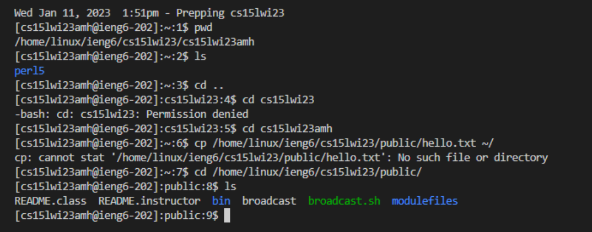

# Tutorial on setting up remote access on VsCode
## First set up your account and change password
Search your CSE15L account name by using your username from your email and your PID. [Link](https://sdacs.ucsd.edu/~icc/index.php).
Then, Change your password by using the CSE15L account name and your AD password. Refer to this tutorial. [Link](https://docs.google.com/document/d/1hs7CyQeh-MdUfM9uv99i8tqfneos6Y8bDU0uhn1wqho/edit)

## Second install VSCode and GitBash
Install VSCode by using this link [Link](https://code.visualstudio.com/) and install git by using this link [Link](https://git-scm.com/downloads). You will see the following picture after you open VSCode.

## Third set default terminal to git on VSCode
Refer to the following tutorial [Link](https://stackoverflow.com/questions/42606837/how-do-i-use-bash-on-windows-from-the-visual-studio-code-integrated-terminal/50527994#50527994)

## Fourth remote connecting
Type the following command to your terminal `ssh cs15lwi23zz@ieng6.ucsd.edu` with `zz` replaced with your own CSE15L account name. If it is your first time login, you need to enter yes. If not, you just enter your password.

## Fifth try some command
You can try some commands to navigate the file system.

`pwd`

The output is /home/linux/ieng6/cs15lwi23/cs15lwi23amh which shows my current working directory.

`ls`

The output is perl5 which means that there is one folder called perl5 inside cs15lwi23amh

`cd ..`
There is no output. It just change my current working directory to one level above (to cs15lwi23)

In this part, I learned how to connect to the remote server by using ssh. I also learned how to navigate the remote server, including copy file, make direcory, and delete file. These are all very interesting. By using this knowledge, I will be able to connect to the remote server of my lab and do deep learning experiment on the server's gpu.

``

